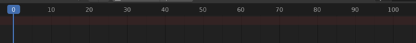

# Animation Converter

[](https://www.gnu.org/licenses/gpl-3.0)

*Copyright © 2021-2024 Ascomods*

## Description

Animation converter is an open-source tool that aims at converting some custom proprietary animation formats and export them into an FBX file, and vice-versa.

Game Compatibility List (PS2 | PS3):
```
DragonBall Z Budokai Tenkaichi 3
DragonBall Raging Blast 1
DragonBall Raging Blast 2
DragonBall Z Ultimate Tenkaichi (Untested)
```

Credits to revel8n, HiroTex and to the rest of the RB modding community and Tenkaichi modding server for their contributions.

In-game example of custom imported animation:


## Limitations

Currently there are unresolved bugs regarding rotations.

Version 1.5 has ANM format support but SPA format is not working anymore.

These bugs might be tackled in the future.

## Usage

Get either version 1.0 (for SPA) or 1.5 (for ANM) [here](https://github.com/ascomods/anim-converter/releases).

List all commands:
```
anim_converter.exe 
```

Example with the SPA file format:

### Export

```
anim_converter.exe --to=fbx input.fbx (spa_folder|input.spa) output.fbx
```

`--to=fbx`: Export format

`input.fbx`: Input fbx file path, extracted with [Game Assets Converter](https://github.com/ascomods/game-assets-converter) or [Noesis](https://richwhitehouse.com/index.php?content=inc_projects.php)

`(spa_folder|input.spa)`: Folder path containing SPA files or SPA input file

`output.fbx`: Output path for the generated fbx file with exported animations

### Import

```
anim_converter.exe --to=spa input.fbx output_folder
```

`--to=spa`: Input format

`input.fbx`: Input fbx file path, that contains animations we want to import back

`output_folder`: Folder path where output SPA files will be exported

For a full example, check the [Tutorial](#tutorial).

## Run from source

Python version: `3.7.9`

Dependencies:
```
FBX Python SDK: 2020.2.1 (provided in the libs folder)
Wine for linux support (tested with 8.1, might work with earlier versions)
```

Init a python virtual environment:
```
python -m venv venv
```

Switch to the python virtual environment:

Linux:
```
source venv/bin/activate
```
Windows:
```
venv/Scripts/activate.bat
```

Install libraries using pip:
```
pip install -r requirements.txt
```

Copy the 3 fbx lib files:

Linux (files in `libs/fbx/linux/`) into:
```
venv/lib/python3.7/site-packages/
```

Windows (files in `libs/fbx/windows/`) into:
```
venv/Lib/site-packages/
```

Now you can run the program with:

```
python app.py
```

You can use the same commands as described [before](#usage).

## Tutorial

Here is an example showing how to use the tool to export, modify then import back animations into DragonBall Z Budokai Tenkaichi 3.

Requirements:
* [Animation Converter](https://github.com/ascomods/anim-converter/releases)
* AFS Explorer or [AFS Builder](https://github.com/ascomods/afs-builder)
* Sparking Studio (tested with version 4.5) to extract and import back ANM files
* At least Windows 7 or Linux (only tested in Windows 10 for now)
* Blender (tested with versions 2.93 and 3.00)

The goal here is to combine Piccolo and Goku stand animations in Blender then import them back into the game.

#### Steps

Create an input and output folder (you can create them anywhere you want).


The « goku_fbx » folder contains our FBX input file on which we are going to apply our animations.

The « output » folder will contain our modified ANM files, for now its empty.

FBX files can now be extracted with [Game Assets Converter](https://github.com/ascomods/game-assets-converter).

The file I've used here was extracted from DB Raging Blast 1 with [Noesis](https://richwhitehouse.com/index.php?content=inc_projects.php).

It was also flipped on the X axis to match the game’s default character model orientation.

The input folder will contain our ANM files (that you can get from pak files by using Sparking Studio and AFS Explorer).


Here I’ve renamed the « 035_character_stand.anm » from Piccolo and Goku pak files, so it’s easier to identify them.

We are going to use the animation converter to export the 2 ANM files into out.fbx:

```
anim-converter.exe --to=fbx goku_fbx/goku.fbx input out.fbx
```


Open blender, delete the default stuff (cube, camera, etc). Go to output settings and set the values as such.


Import « out.fbx » file in blender with the following setting for animation


Here is what you should get:


Normally, you should see keyframes in the timeline. Those are the frames of goku stand animation.

You can adjust the timeline to fit the animation length (set the end at keyframe 67 here).

Go to dope sheet menu (shift + F12 on the timeline or access it via the menu).


Then switch to the Action editor


There you have all the animations you’ve included during the import, as actions.


There are multiple ways to create a new animation.

To make a new « combined » animation, I’m going to create a copy of Piccolo’s stand animation (here « BONE_NULL|piccolo_stand.anm| »).


A new copy of the current action has been created (here « BONE_NULL|piccolo_stand.anm|.001 »).

You may also have noticed that Piccolo’s stand animation lasts longer than Goku’s (100 frames vs 67 frames).


So we need to rescale our new animation to fit the initial length (or do the opposite if you prefer a longer animation).

To do so select all keyframes in the action editor and use the S and / or G keys to resize and fit the animation properly in the timeline.


Now to combine the animations, switch to goku’s stand animation and hit the « Push Down » button.


Then switch back to our new animation and use the « Push Down » button here as well.

If you open the NLA (Nonlinear Animation) Editor, you should get something like this.


If there are more tracks, remove them. I always put at the bottom the animation I want to merge with the current one.

Here I want to keep the arms of Piccolo’s stand animation and use the rest of Goku’s stand animation.

To achieve that, I will simply remove the unwanted keyframes from our new animation.

First, in pose mode, select the unwanted bones (I prefer going into wireframe mode to make it easier to select them).


Then in the action editor, select all keyframes and remove them.



If you switch back to solid mode, you should end up with something like this.


We now need to « bake » our new animation in order to fully merge the two previous animations.

To do so, switch to object mode and select your armature.


Then go to Object > Animation > Bake Action.


And use the following settings to bake your animation.


Here I’ve chosen an End Frame at frame 66 to have a frame at the end (multiple of 3).

Of course, there are also other ways to do this if you want a different end frame (you can simply add a keyframe at the end for instance).

Go into pose mode, select all bones and look in the action editor. We now have a new action called « Action » that is our new fully combined animation.

But we have a problem here, all bones in the action editor are not under the « BONE_NULL » as it should be to work properly afterwards.


To solve that, select all keyframes from « Action » and copy them (CTRL + C).

Switch to goku stand animation and remove all its frames except the first one.


Now simply paste previously copied keyframes (CTRL + V).


Give a proper name to the animation, for instance I’m going to call it « new_stand.anm » instead of « BONE_NULL|goku_stand.anm| ».

Adjust your NLA track to look like this.


You can reduce the timeline as well to fit 66 frames instead of 67. All actions that are in the NLA Tracks will be exported as actions in the FBX file.

So if you want to put the previous animations (goku or piccolo stand animations) as well in your FBX file, you can add more tracks.

Now go to File > Export > FBX.


And use the following settings.


We only need the armature. Pay also attention to the « Bake Animation » section.

Indeed, we only need « NLA Strips » and the « Simplify » option should be at 0.00 for the tool to work properly.

Also, be sure to have a sampling rate at 3.00 to get the optimal number of frames for your animation.

Now you can save your FBX file (here I’ve called it « untitled.fbx ») .


Now let’s extract our ANM file from the FBX file by using the Animation Converter:

```
anim-converter.exe --to=anm untitled.fbx output
```

Go to the output folder, you should now see « new_stand.anm » as a file.


We need to rename this back to « 035_character_stand.anm » and copy it among Goku’s files in the previously extracted pak folder.

Use Sparking Studio to rebuild the pak file.

Import the pak file back into the game (with AFS Explorer) and test in-game.


For now all this is still experimental, feel free to test and report bugs.
